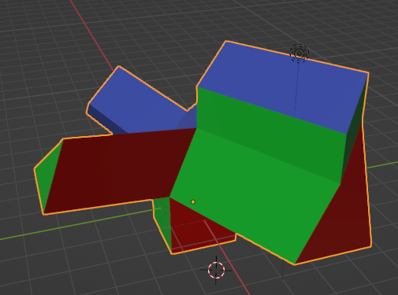
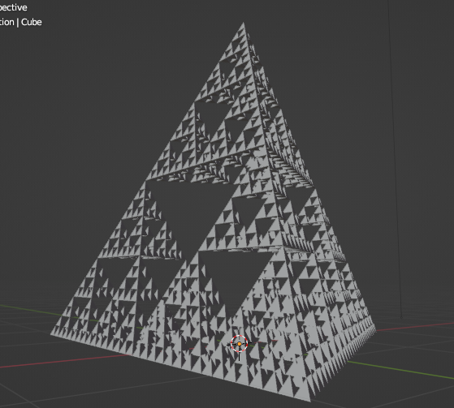
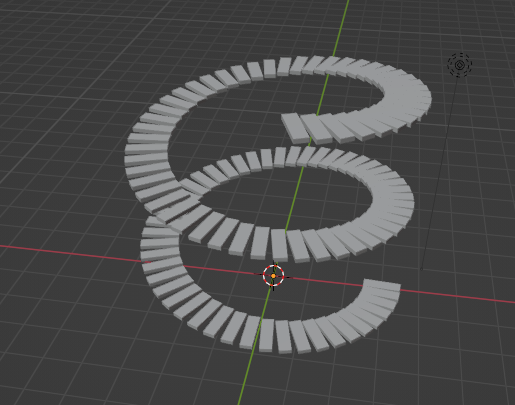

# ジオメトリノード作例集

|RubikCube.blend (WIP)|CaptureNormal.blend
|---|---|
||

|CornerDecoration.blend (WIP)|OctopusArms.blend (Youtube動画参考)
|---|---|
||

|FractalPyramid.blend|InstantiateOnTwoCircles.blend
|---|---|
||

|SimpleWave.blend|InstantiateOnFace.blend
|---|---|
||

|SineWave.blend|SpiralLadder.blend
|---|---|
||

|SimpleGear.blend|HandrailLadder.blend
|---|---|
||
